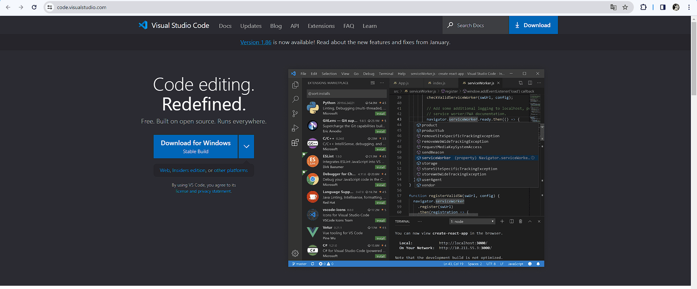

# 環境構築

## このドキュメントを見てわかること

TechTrain Railwayの問題を解くためにDockerとVisual Studio Codeが必要です．  
そのため，自身のPC環境にDockerとVisual Studio Codeのインストールをします．  
Visual Studio CodeにTechTrain Railwayのクリア条件を判定するツールをインストールします．  
次に，GitHubのリポジトリをフォークし，自身のPC環境にコードをダウンロードします．  
最後に，Dockerに関するコマンドを実行し，環境構築を行います．

### 環境構築について

1. Docker Desktopのインストール
   1. Docker Desktopのダウンロードとインストール  
        [Install Docker Desktop on Windows](https://docs.docker.com/desktop/install/windows-install/) からDocker Desktopをダウンロードし，インストールします．
        
2. Visual Studio Codeのインストール  
    [Visual Studio Code](https://code.visualstudio.com/) から自分のOSに適したVisual Studio Codeをダウンロードする。
    
3. Visual Studio CodeにTechTrain Railwayのクリア条件を判定するツールをインストール  
    Visual Studio Codeを開き、拡張機能（Extensions）から「TechTrain Railway」という拡張機能を検索してインストールします。これにより、Railwayのクリア条件を簡単に判定できるようになります。
    
4. GitHubリポジトリのフォークとダウンロード
    1. GitHubリポジトリのフォーク
        [TechBowl-japan/laravel-stations-2 | GitHub](https://github.com/TechBowl-japan/laravel-stations-2) にアクセスし、右上の"Fork"ボタンをクリックして、リポジトリを自分のGitHubアカウントにフォークします。
    2. GitHubリポジトリのダウンロード
        フォークが完了したら、自分のGitHubアカウント上でフォークされたリポジトリを選択し、"Code"ボタンをクリックして、リポジトリのURLをコピーします。そして、ターミナルを開いて以下のコマンドを実行してリポジトリをダウンロードします．
        ```bash
        git clone https://github.com/{{あなたのGitHubID}}/laravel-stations-2.git
        ```
5. Visual Studio Codeでダウンロードしたリポジトリを開く
    ターミナルでリポジトリをダウンロードしたら、Visual Studio Codeを起動し、ファイル -> フォルダを開くを選択して、ダウンロードしたリポジトリのディレクトリを選択します。
6. Dockerコマンドでコンテナを起動
    ターミナルでリポジトリのディレクトリに移動し、以下のコマンドを実行してDockerコンテナを起動します。
    ```bash
    docker compose up -d
    ```
7. [http://localhost:8888](http://localhost:8888) にアクセスする

以上で問題解決のための環境が整いました。  
Visual Studio Codeを使用してコードを編集し、「TechTrain Railway」という拡張機能から「できた!」と書かれた青いボタンをクリックすると判定が始まります．
